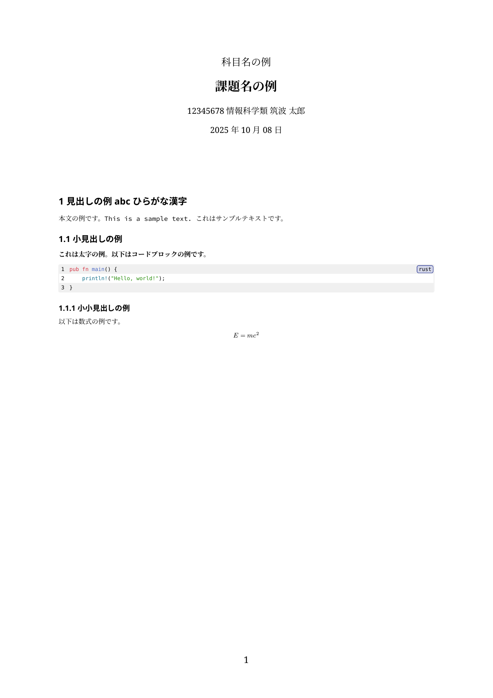

## report-template

個人的に小さいレポートを書くときに使うテンプレート



### Dependencies

- [typst](https://typst.app/)
- [Source Code Pro](https://fonts.google.com/specimen/Source+Code+Pro) (for code font)
- [Noto Serif JP](https://fonts.google.com/specimen/Noto+Serif+JP) (for Japanese font)

### Usage

```bash
typst compile main.typ
```

### License

[MIT License](./LICENSE)
